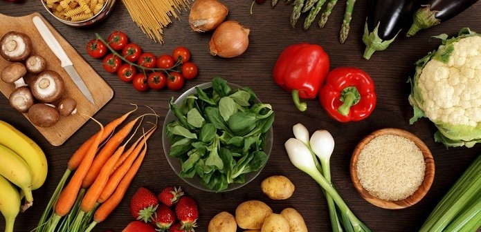
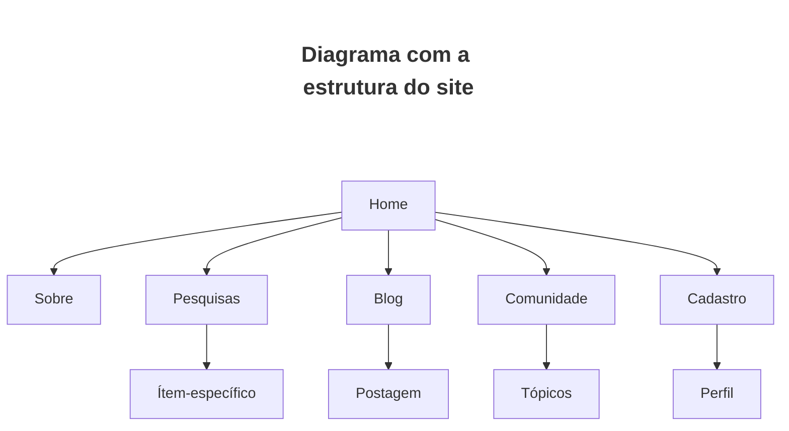

<h1>
    Veganices
</h1>

Veganices é um site ideal para os veganos , e também para os que pretende se tonar ou tem curiosidade , temos diversas dicas e opções como profissionais especializados , melhores restaurantes , depoimentos reais de veganos , blog com diversas pessoas interagindo para ajudar com dúvidas , produtos , etc.

<h2>
    Índices
</h2>

[TOC]

# Criadores

<ul>
     
        
        
        
        
        
    </ul>

# Comunidades

Ambiente de interação entre os usuários. A página será apresentada com diversos tópicos de conversas, e se acessadas, permitirá ver o histórico de todos os comentários e campo para incluí-lo.O usuário também poderá iniciar um novo tópico que será apresentado na página inicial (Comunidade) e ficará disponível para comentários.

# Blog

 Será destinado à apresentação de notícias diversas sobre o veganismo. Terá informações sobre o que acontece no cenário atual, vídeos e outros tópicos relevantes sobre o assunto.

# Produtos

 Terá lista com opções de vestuário/ calçados, produtos de beleza e alimentação. O usuário será direcionado à página de busca podendo verificar localização, serviços oferecidos e preço. Clicando em alguma das opções, será exibida informação completa e campo para contato direto com o local 

# Profissionais

 Onde o usuário poderá buscar profissionais específicos na área (nutrólogos, pediatras e nutricionistas). Estes profissionais também poderão se cadastrar (tela de cadastro), sendo identificado de forma diferenciada nessa busca. 

# Restaurantes

  Será apresentada ao usuário uma lista de diversos restaurantes, à princípio por ordem de classificação. Será possível filtrar por localidade, preço e tipo de restaurante (100%vegano, crudívoro, ovolacto, etc..). Clicando em alguma das opções, será exibida informação completa e campo para contato direto com o local. 

